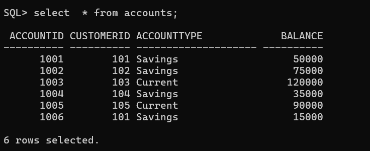
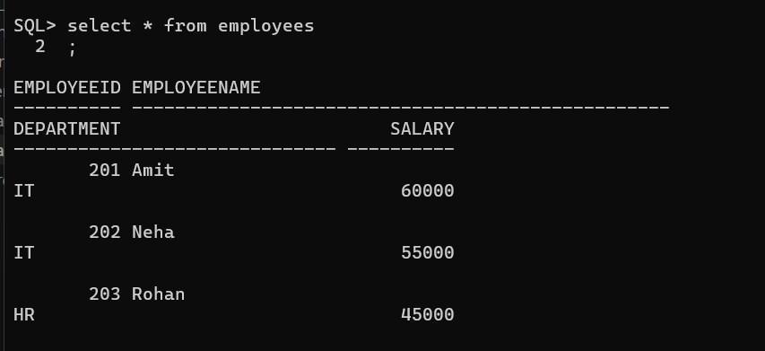
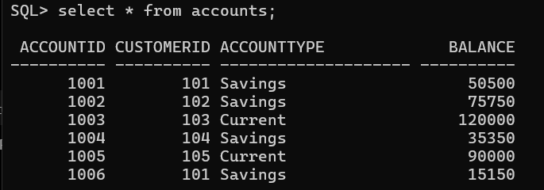
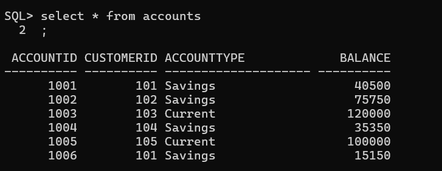

# Stored Procedures

## 1st Scenario

### Before Executing

### After Executing

---

## 2nd Scenario

### Before Exection

### After Exection

---

## 3rd Scenario

### Before Exectuion

### After Exection

