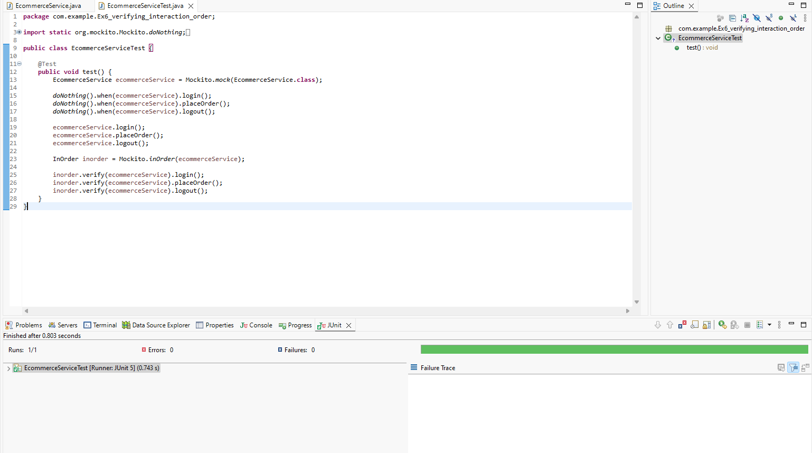
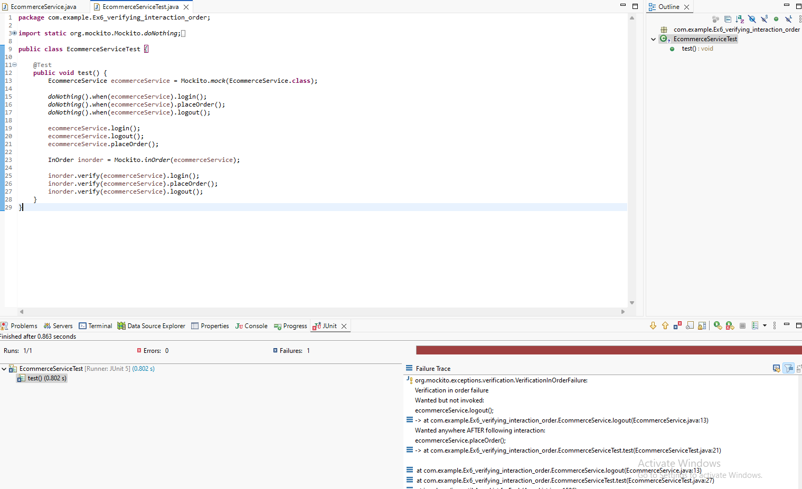

# Verifying Interaction Order

## Created  Ecommerce Service class which has login, place order and logout method these actions has to be in a specific order, so created a mock class and verified its method interaction order with InOrder object.

### Pass Case

---

### Fail Case

